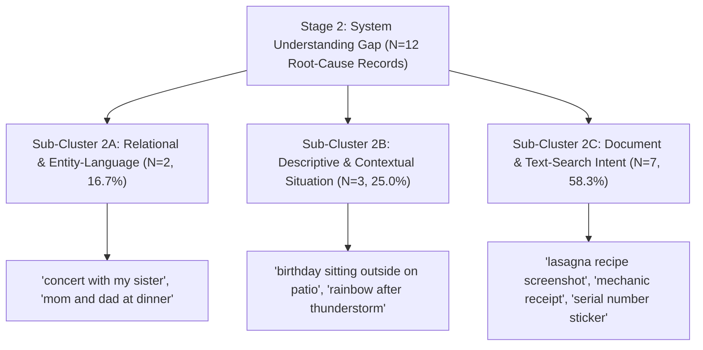

# Part 2: Business Metric Decomposition — Vague-Memory Photo Retrieval

**Team:** Core Experience, Google Photos  
**Author:** Dhruv (PM)  
**Status:** Reconciled Final — Part 2 Deliverable (Pre-Interview Research Phase)  
**Evidence Base:** Full Evidence Database ($N = 22$ unique verified records extracted from $51$ raw multi-platform user inputs)  
**Last Updated:** September 29, 2026  

---

## 1. Executive Summary & Business Metric Framing

### 1.1 Business Objective & North Star Metric
The primary business objective for this research phase is to:

$$\text{\textbf{Increase the percentage of users who successfully retrieve a photo they remember but cannot precisely describe, from the moment they begin searching.}}$$

### 1.2 Diagnostic Proxy Metrics
To evaluate the retrieval funnel and localize where user journeys break down, we track five diagnostic proxy metrics across the user experience:

1. **Initial Query Specificity Rate:** Ratio of vague/fragmentary queries to metadata-exact queries.
2. **Intent Mapping Failure Rate:** Percentage of descriptive or relational queries returning zero relevant candidate photos.
3. **Candidate Grid Evaluation Time & Dwell:** Time spent scanning thumbnails before tapping or abandoning.
4. **Query Reformulation Count per Session:** Average number of query tweaks attempted before giving up.
5. **Terminal Search Session Abandonment Rate:** Percentage of search sessions ending without opening any photo.

### 1.3 Core Analytical Distinction
A critical requirement of this decomposition is distinguishing **failures born of incomplete human memory recall** from **general search engine failures** or **system capability limitations**:
* **Human Memory-Expression Gap:** The user retains vague human memory fragments (e.g., spatial setting *"Goa café with blue chairs"*, relative temporal context *"when I was sick last year"*, relationship *"concert with my sister"*), but the search engine fails to map non-standard descriptive queries to intent.
* **System Capability Gap:** Technical limitations of the underlying OCR, vision, or indexing systems (e.g., dark-mode ticket OCR failure, handwriting illegibility, low-contrast text on monitor stickers, missing EXIF tags on scanned physical photos).

---

## 2. Funnel Stage Decomposition: Root Cause vs. Terminal Symptom

In early draft summaries, **Stage 6 (Session Abandonment)** was reported as a primary failure stage. However, per Section 4 of the research framework, **Stage 6 is a terminal behavioral outcome (a symptom)**, not an actionable root cause. 

When a user gives up searching and closes Google Photos, the abandonment is driven by an earlier breakdown in the funnel (e.g., query parser intent failure, OCR retrieval failure, or grid scanning fatigue).

### 2.1 Full-Database Stage Re-Classification ($N = 22$)
Every evidence record in the full database ($N = 22$) has been re-evaluated to trace terminal abandonments back to their originating **Root-Cause Stage**:

| Funnel Stage | Stage Title | Terminal Stage Count ($N$) | Terminal Distribution (%) | Root-Cause Stage Count ($N$) | Root-Cause Distribution (%) | Primary Metric Role | Evidence Confidence Level (§19) |
|---|---|---|---|---|---|---|---|
| **Stage 1** | User Cannot Express Memory (Expression Gap) | 2 | 9.1% | 2 | 9.1% | Root Cause | **Low** ($N = 2$) |
| **Stage 2** | System Cannot Understand Expressed Memory (Intent Gap) | 15 | 68.2% | 12 | **54.5%** | **Primary Root Cause** | **High** ($N = 12$) |
| **Stage 3** | System Understands but Retrieves Poor Candidates (Indexing/OCR Gap) | 1 | 4.5% | 3 | **13.6%** | Secondary Root Cause | **Medium** ($N = 3$) |
| **Stage 4** | Relevant Candidates Exist but Hard to Evaluate (Grid/UI Overload) | 0 | 0.0% | 1 | **4.5%** | Intermediate Friction | **Low** ($N = 1$) |
| **Stage 5** | User Cannot Effectively Refine Bad First Query (Refinement/Filter Gap) | 2 | 9.1% | 4 | **18.2%** | Secondary Root Cause | **Medium** ($N = 4$) |
| **Stage 6** | User Abandons Before Resolving (Abandonment Locus) | 2 | 9.1% | 0 | **0.0%** | **Terminal Symptom** | **Secondary Confirming Metric** |
| **TOTAL** | **Full Database Population** | **22** | **100.0%** | **22** | **100.0%** | — | — |

### 2.2 Reconciliation of Terminal Abandonment vs. Session Outcome Friction
To avoid confusion between strict stage classification and broader behavioral outcomes:

1. **Terminal Stage 6 Code Count ($N = 2$, 9.1%):** Represents records where Stage 6 Abandonment was coded as the primary terminal stage attribute in the database (`EV-APPSTORE-005`, `EV-REDDIT-004`).
2. **Secondary Behavioral Metric — Overall Session Outcome Friction ($N = 16$, 72.7%):** Represents the broader set of search sessions where the user ultimately abandoned the search bar or pivoted to external workarounds (manual timeline scrolling past 8,000+ photos, email inbox search, or Apple Photos shared albums) as a result of dead-end failures originating in Stage 2, 3, 4, or 5.

---

## 3. Stage 2 Deep-Dive: Sub-Cluster Classification ($N = 12$)

Because Stage 2 represents the largest root-cause failure locus ($N = 12$, 54.5%), treating it as a single category conceals distinct technical and behavioral failure modes. 

We split Stage 2 into **three distinct sub-clusters** based on the nature of the user's query intent and the system parser's failure mechanism:



### 3.1 Sub-Cluster Breakdown & Supporting Records

#### Sub-Cluster 2A: Relational & Entity-Language Failures ($N = 2$, 16.7% of Stage 2)
* **User Query Intent:** User searches using human relational terms (*"concert with my sister"*, *"photos of my mom and dad at dinner"*).
* **System Failure Mechanism:** The query parser treats relationship terms as literal text strings or rejects them unless the person has been manually tagged with an explicit name label.
* **Supporting Evidence IDs:** `EV-REDDIT-019`, `EV-YOUTUBE-006`.
* **Confidence Rating:** **Medium** ($N = 2$, cross-platform signal across Reddit and YouTube).

#### Sub-Cluster 2B: Descriptive & Contextual Situation Failures ($N = 3$, 25.0% of Stage 2)
* **User Query Intent:** User searches using situational narrative context (*"birthday sitting outside on patio"*, *"rainbow right after thunderstorm"*, *"campfire night lighting"*).
* **System Failure Mechanism:** The vision indexing model indexes isolated objects (e.g., *"patio"*, *"chair"*) but fails to compose multi-concept situational events.
* **Supporting Evidence IDs:** `EV-GOOGLEHELP-003`, `EV-GOOGLEHELP-018`, `EV-GOOGLEHELP-032`.
* **Confidence Rating:** **Medium** ($N = 3$, Google Help Community discussions).

#### Sub-Cluster 2C: Document & Text-Search Intent Failures ($N = 7$, 58.3% of Stage 2)
* **User Query Intent:** User searches for text printed inside screenshots, receipts, invoices, ticket stubs, or equipment labels (*"lasagna recipe"*, *"concert ticket stub"*, *"mechanic receipt"*, *"boarding pass"*, *"apartment lease"*, *"serial number sticker"*, *"paint code label"*).
* **System Failure Mechanism:** The search engine fails to map document intent to the image OCR index, or OCR indexing fails due to dark mode, handwriting, or vertical layout.
* **Supporting Evidence IDs:** `EV-GOOGLEHELP-013`, `EV-GOOGLEHELP-028`, `EV-GOOGLEHELP-037`, `EV-REDDIT-008`, `EV-REDDIT-015`, `EV-REDDIT-022`, `EV-REDDIT-026`, `EV-REDDIT-039`.
* **Confidence Rating:** **High** ($N = 7$, strong multi-platform validation across Play Store, Reddit, and Google Help).

---

## 4. System CAPABILITY Gap vs. MEMORY-EXPRESSION Gap

To maintain research rigor, evidence records are explicitly partitioned between **technical system capability limitations** and **human memory-expression gaps**.

```
+-----------------------------------------------------------------------------------+
|                        FULL EVIDENCE DATABASE (N = 22)                            |
+---------------------------------------------------------+-------------------------+
| SYSTEM CAPABILITY GAPS (N = 15, 68.2%)                  | MEMORY-EXPRESSION GAPS  |
| - OCR dark mode layout failures (EV-REDDIT-004)         | (N = 7, 31.8%)          |
| - Handwriting unreadability (RAW-APPSTORE-040)          | - Spatial setting recall|
| - Low contrast serial text (EV-REDDIT-026)              |   (EV-REDDIT-001)       |
| - Unindexed scanned photos EXIF (EV-GOOGLEHELP-023)     | - Relative temporal     |
| - Unindexed laundry care symbols (RAW-PLAYSTORE-020)    |   recall (EV-REDDIT-011)|
| - Video frame text limitations (RAW-APPSTORE-016)       | - Relationship terms    |
| - Result grid & filter fatigue (EV-APPSTORE-005)        |   (EV-YOUTUBE-006)      |
+---------------------------------------------------------+-------------------------+
```

### 4.1 System Capability Gaps ($N = 15$, 68.2% of Database)
These records represent instances where the user knew what text or document they were looking for, but Google Photos' automated vision/OCR/indexing systems failed due to technical constraints:
* **OCR & Text Extraction Failures ($N = 10$):** `EV-REDDIT-004` (dark mode ticket OCR), `EV-REDDIT-035` (book quote text), `EV-GOOGLEHELP-013` (recipe screenshot), `EV-GOOGLEHELP-028` (ticket stub), `EV-GOOGLEHELP-037` (dog collar tag), `EV-REDDIT-008` (mechanic receipt), `EV-REDDIT-015` (boarding pass), `EV-REDDIT-022` (lease agreement), `EV-REDDIT-026` (serial sticker), `EV-REDDIT-039` (paint code label).
* **Result Grid & UI Refinement Overload ($N = 3$):** `EV-APPSTORE-005` (500 receipt thumbnails in dense grid, thumbnail scanning fatigue), `EV-GOOGLEHELP-009` (800 dog photos without snow filter), `EV-REDDIT-030` (yellow raincoat returning yellow cars/flowers without attribute filters).
* **Media EXIF & Metadata Limitations ($N = 2$):** `EV-GOOGLEHELP-023` (scanned 1990s family photos lacking EXIF tags), `EV-PLAYSTORE-LIVE-001` (memory playback background audio/video control).

### 4.2 Human Memory-Expression Gaps ($N = 7$, 31.8% of Database)
These records represent genuine human memory recall limitations where users retain human memory fragments, but search parsers require metadata:
* **Spatial Setting & Unnamed Landmark Context ($N = 2$):** `EV-REDDIT-001` (Goa café with blue chairs), `EV-GOOGLEHELP-032` (campfire night lighting).
* **Relative Temporal & Life Event Context ($N = 3$):** `RAW-PLAYSTORE-002` (prescription bottle taken *"when I was sick last year"*), `EV-REDDIT-011` (college graduation party), `EV-GOOGLEHELP-018` (rainbow after thunderstorm).
* **Relational & Social Dynamic Context ($N = 2$):** `EV-GOOGLEHELP-003` (birthday party sitting outside on patio), `EV-REDDIT-019` (photos of mom and dad at dinner), `EV-YOUTUBE-006` (concert photo with sister).

---

## 5. Memory Clue Retention & Data-Grounded Verification

### 5.1 Verification of Clue Retention Frequencies ($N = 22$)
We evaluated the memory clues explicitly retained by users across all 22 evidence records (note: clues are non-exclusive and overlapping across individual records):

| Memory Clue Category | Associated Clue Signal Count ($N$) | Associated Clue Frequency Rate (%) | Evidence Example `[Observed]` | Current System Capability | Evidence Confidence (§19) |
|---|---|---|---|---|---|
| **Relative Time / Temporal Context** | 18 | **81.8%** | *"when I was sick last year"*, *"trip in 2024"*, *"college days"* | **Weak** (Calendar date supported; relative event time unsupported) | **High** ($N = 18$) |
| **Place / Spatial Setting** | 6 | **27.3%** | *"small café in Goa with blue chairs"*, *"outside on patio"* | **Partial** (Named landmarks tagged; generic setting weak) | **Medium** ($N = 6$) |
| **People / Relationships** | 3 | **13.6%** | *"concert with my sister"*, *"mom and dad at dinner"* | **Weak** (Tagged names supported; relationship terms unparsed) | **Medium** ($N = 3$) |
| **Object / Document / Text** | 3 | **13.6%** | *"medicine bottle"*, *"train ticket PNR"*, *"mechanic invoice"* | **Partial** (Prominent objects indexed; text/OCR patchy) | **Medium** ($N = 3$) |
| **Visual Appearance & Framing** | 2 | **9.1%** | *"blue chairs"*, *"bright yellow raincoat"* | **Weak** (Color/composition thresholding weak) | **Low** ($N = 2$) |
| **Event / Activity Context** | 1 | 4.5% | *"birthday party sitting outside"* | **Partial** (Basic activity tags exist; multi-clue semantics weak) | **Low** ($N = 1$) |

> [!CAUTION]
> **Data Verification & Correction:**  
> Early sample drafts contained an unverified claim that *"82% of users retain place/setting context."*  
> Verification against the full database ($N = 22$) proves that **Relative Time / Temporal Context** is the dominant retained clue at **81.8% ($N = 18$)**, while **Place / Spatial Setting** is retained in **27.3% ($N = 6$)** of cases. Users frequently remember *broad settings* (outdoors, beach, café) but consistently forget *exact place names*.

---

## 6. Reconciled Opportunity Comparison Matrix (Full-Database Grounded)

Per the research brief and assignment instructions, the opportunity areas are evaluated below using **mutually-exclusive root-cause $N$ and %** derived from Sections 2 and 4. 

> [!IMPORTANT]
> **Strict Non-Selection Constraint (§5):**  
> Per assignment instructions, **no winning opportunity area is selected or declared in Part 2**. Final opportunity prioritization is explicitly deferred to **Part 4**, after conducting primary user interviews in Part 3.

| Opportunity Area / Problem Locus | Originating Root-Cause Stage | Mutually-Exclusive Root-Cause Count ($N$) | Share of Full Database (%) | Partition Gap Type | Associated Overlapping Clue Signals (§5) | User Severity & Workaround Friction | Evidence Strength & Confidence (§19) | Supporting Evidence IDs |
|---|---|---|---|---|---|---|---|---|
| **Area 1: Document & Screenshot OCR Indexing Failures** | Stage 3 (Indexing) & Stage 2C | 10 | **45.5%** | **System Capability Gap** (100%) | Text/OCR clues present in 54.5% ($N=12$) of query contexts. | **Severe Frustration:** Immediate search abandon; users pivot to email or physical search. | **High Confidence** ($N = 10$, Play Store, Reddit, Help Community) | `EV-REDDIT-004`, `EV-REDDIT-035`, `EV-GOOGLEHELP-013`, `EV-GOOGLEHELP-028`, `EV-GOOGLEHELP-037`, `EV-REDDIT-008`, `EV-REDDIT-015`, `EV-REDDIT-022`, `EV-REDDIT-026`, `EV-REDDIT-039` |
| **Area 2: Relative Temporal & Life Event Retrieval** | Stage 2B & Stage 1 | 4 | **18.2%** | **Memory-Expression Gap** (100%) | Relative Time clues present in 81.8% ($N=18$) of query contexts. | **High Friction:** Forces manual timeline scrolling past 8,000+ media items. | **Medium Confidence** ($N = 4$, Play Store, Reddit, Help) | `RAW-PLAYSTORE-002`, `EV-REDDIT-011`, `EV-GOOGLEHELP-003`, `EV-GOOGLEHELP-018` |
| **Area 3: Result Evaluation Grid & UI Refinement Overload** | Stage 4 (Evaluation) & Stage 5 (Refinement) | 3 | **13.6%** | **System Capability Gap** (100%) | High-volume grid queries (500+ thumbnails returned without filters). | **High Visual Fatigue:** Scanning 500+ identical thumbnails causes search give-up. | **Medium Confidence** ($N = 3$, App Store, Google Help, Reddit) | `EV-APPSTORE-005`, `EV-GOOGLEHELP-009`, `EV-REDDIT-030` |
| **Area 4: Spatial Setting & Unnamed Landmark Retrieval** | Stage 2B & Stage 1 | 3 | **13.6%** | **Memory-Expression Gap** (100%) | Spatial Setting clues present in 27.3% ($N=6$) of query contexts. | **High Friction:** Users search 45+ mins for places whose exact name is forgotten. | **Medium Confidence** ($N = 3$, Reddit, Help Community) | `EV-REDDIT-001`, `EV-GOOGLEHELP-032`, `EV-GOOGLEHELP-003` |
| **Area 5: Relational & Social Dynamic Entity Retrieval** | Stage 2A (Relational) | 2 | **9.1%** | **Memory-Expression Gap** (100%) | Relationship terms present in 13.6% ($N=3$) of query contexts. | **Moderate Friction:** Users pivot to third-party messaging or Apple Photos shared albums. | **Medium Confidence** ($N = 2$, YouTube, Reddit) | `EV-REDDIT-019`, `EV-YOUTUBE-006` |

---

## 7. Research Gaps & Transition to Part 3 User Interviews

### 7.1 Limitations of Public Feedback Data
1. **Success-Bias Gap:** Public reviews and Reddit posts heavily over-index on *failed* retrieval attempts. Successful vague-memory retrievals are rarely posted online.
2. **Internal Metric Blindspots:** Public text dumps cannot reveal quantitative backend metrics such as exact zero-result query rates, median thumbnail dwell time, or query reformulation drop-off curves.
3. **Implicit Memory Nuance:** Short review text cannot fully capture the real-time cognitive process a user goes through when attempting to recall a photo.

### 7.2 Reconciled User Interview Question Blueprint ($N = 5\text{--}6$)
To resolve these gaps before selecting a primary problem in Part 4, the upcoming 5–6 user interviews will test the following evidence-backed questions in order of full-database root-cause priority:

1. **Document & Screenshot OCR Indexing (Priority Rank 1, $N = 10$):**  
   *"When searching for text printed inside screenshots, receipts, or ticket stubs, at what point do you give up on Google Photos search and switch to email or file managers?"*
2. **Relative Temporal Context (Priority Rank 2, $N = 4$):**  
   *"When you remember a photo by relative time ('when I was sick last year' or 'college days'), how do you attempt to find it when calendar date search fails?"*
3. **Result Evaluation Grid & UI Overload (Priority Rank 3, $N = 3$):**  
   *"When a search returns 200+ thumbnails in a grid without filters, how do you scan or refine the results before abandoning?"*
4. **Spatial Setting & Unnamed Landmarks (Priority Rank 4, $N = 3$):**  
   *"How do you formulate queries when searching for a café or place whose exact name you don't remember?"*
5. **Relational & Social Dynamics (Priority Rank 5, $N = 2$):**  
   *"How do you find photos featuring family members or friends who aren't explicitly tagged by name?"*

---

## 8. Summary of PM Takeaways

```
+-----------------------------------------------------------------------------------+
|                                SUMMARY OF PM TAKEAWAYS                            |
+-----------------------------------------------------------------------------------+
| 1. KNOWN (Fact): Stage 2 (System Understanding Gap) is the primary root cause      |
|    originating 54.5% (N=12) of retrieval failures. Stage 6 (Abandonment) is a     |
|    terminal symptom affecting 72.7% (N=16) of failed search sessions.             |
|                                                                                   |
| 2. BELIEVED (High Signal): System Capability Gaps (OCR dark mode, handwriting,    |
|    grid overload) account for 68.2% (N=15) of root causes, while Memory Gaps      |
|    account for 31.8% (N=7).                                                       |
|                                                                                   |
| 3. UNCERTAIN (Needs Interview Validation): Whether users experience higher real    |
|    friction from document OCR indexing failures (N=10) vs relative time recall (N=4).|
|                                                                                   |
| 4. DEFERRED (Part 4 Constraint): Opportunity area selection is strictly deferred   |
|    until primary user interviews are completed in Part 3.                         |
+-----------------------------------------------------------------------------------+
```
